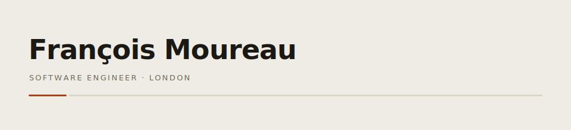

<a href="https://francoismoureau.com">
  <picture>
    <source media="(prefers-color-scheme: dark)" srcset="banner-dark.svg">
    
  </picture>
</a>

- **based** — London
- **work** — Software engineer
- **building** — [`boe-mcp`](https://github.com/moureauf/boe-mcp) + a small family of personal-data MCP servers
